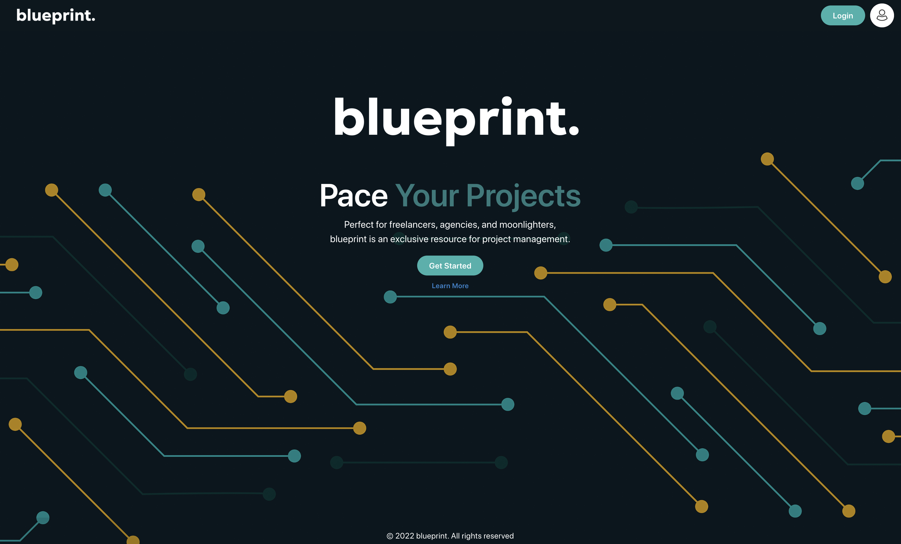
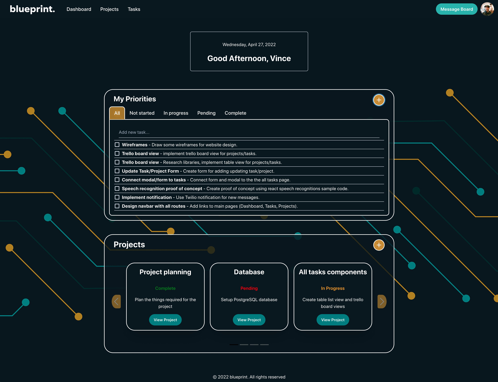
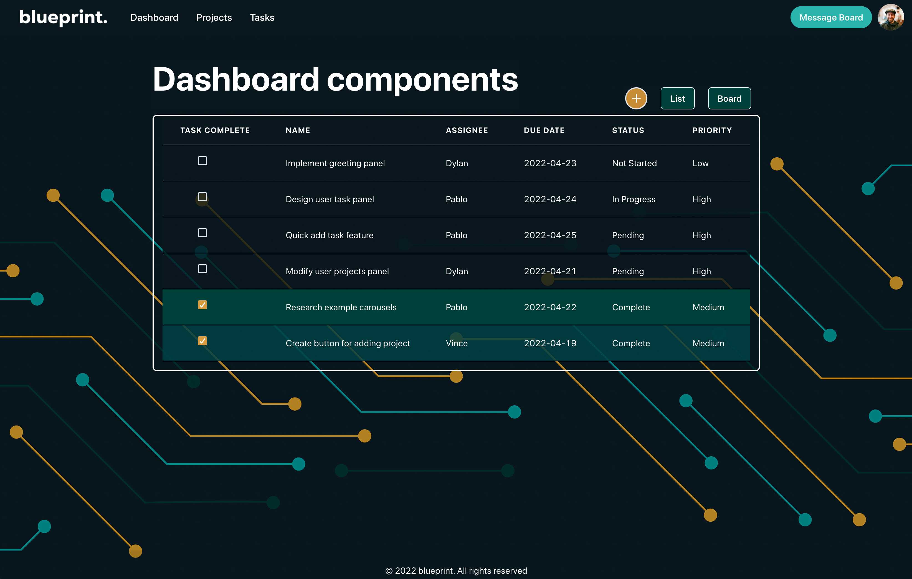
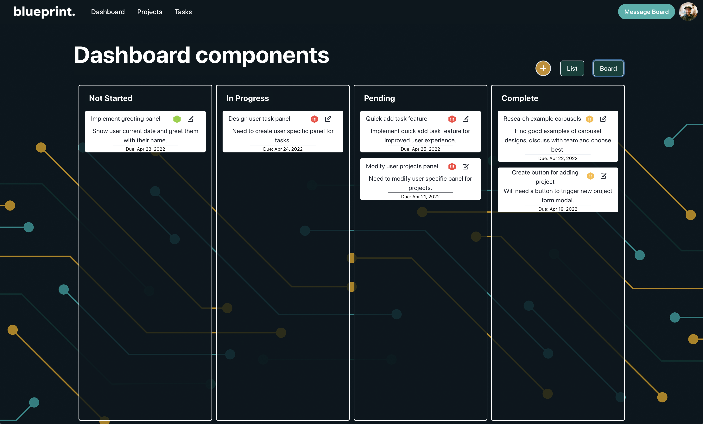
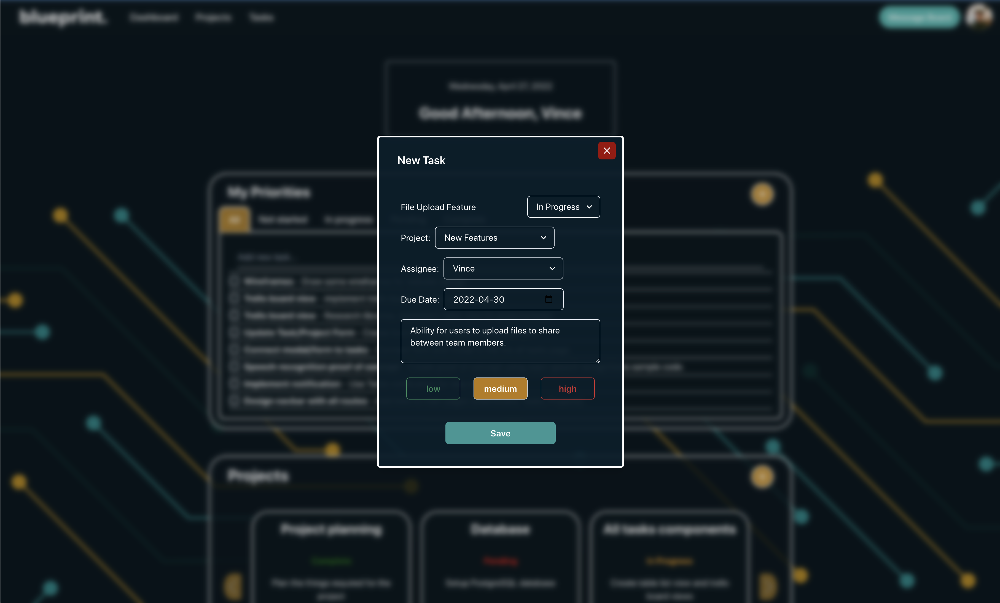
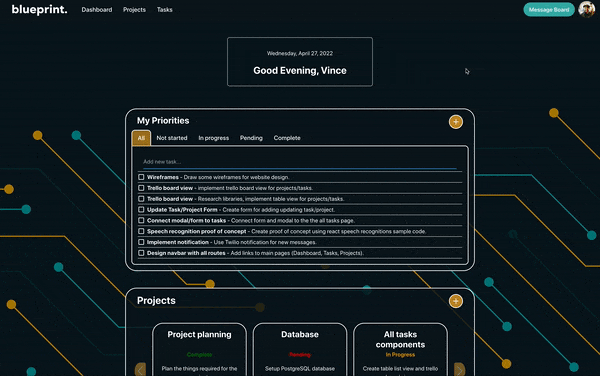
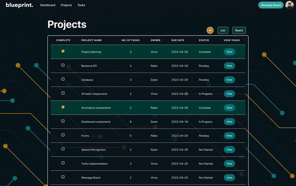
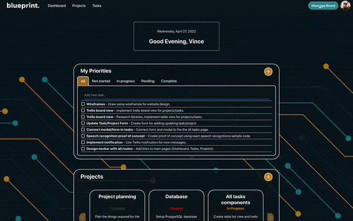
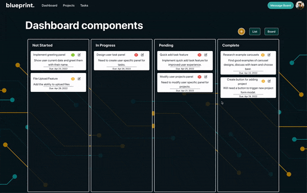
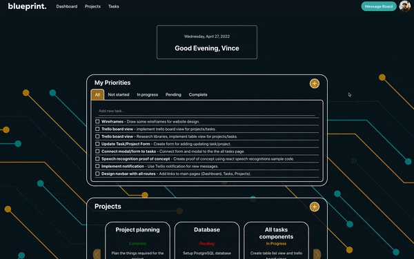

<h1 align="center">blueprint.</h1>

## Table Of Contents

- [Summary](#summary)
  - [Features](#features)
  - [Screenshots](#screenshots)
  - [GIFs](#gifs)
- [Getting Started](#getting-started)
  - [Client](#client)
    - [Setup](#setup)
    - [Running Dev Server](#running-webpack-development-server)
    - [Dependencies](#client-dependencies)
  - [Server](#server)
    - [Setup](#api-setup)
    - [Resetting the Database](#database-reset)
    - [Depenencies](#server-dependencies)
- [Planning](#planning)
  - [ERD Diagram](#erd-diagram)
  - [User Stories & Routes](#user-stories--routes)
  - [Wireframe](#wireframe)
- [About](#about)
  - [Frameworks & Libraries](#frameworks-and-libraries)
  - [Purpose](#purpose)

# Summary

A streamlined project management app that strips away excess functionalities and focuses on simplictiy of user experience. This application was built using React, Express, Node, and Chakra UI.

## Features

- Ability to quickly add tasks on dashboard page
- Speech recognition (Digital Assistant) available on all pages
  - Navigate to new page
  - Create new tasks or projects
  - To access this feature, use " Shift + ` " to start speech recognition
    - To stop using speech recognition, use " \ "
- Multiple views for diplaying Task and Projects
  - Trello Board View
  - List / Detail View
- Edit task or projects details easily by clicking on them
- Message board to communicate with members of your team
  - Ability to opt-in to text notifications
- Minimalistic dark theme design

## Screenshots

### Home Page



### Dashboard



### Project View



### Trello Board View



### New Task Form



## GIFs

### Dashboard



### Voice Command - Navigate to Dashboard



### Message Board



### Trello Board View



### Voice Command - Create New Project



# Getting Started

## **Client**

```sh
cd frontend
```

### Setup

Install dependencies with

```sh
npm install
```

### Running Webpack Development Server

```sh
npm run start
```

Server should be hosted on `http://localhost:3000/`

## Client Dependencies

- @chakra-ui/icons: ^1.1.7
- @chakra-ui/reac": 2.0.0-next.0
- @coreui/coreui: ^4.1.3
- @coreui/react: ^4.1.2
- @emotion/react: ^11.9.0
- @emotion/styled: ^11.8.1
- axios": ^0.26.1
- bootstrap: ^5.1.3
- moment: ^2.29.2
- natural-drag-animation-rbdnd: ^2.1.0
- next: ^12.1.5
- react: ^18.0.0
- react-beautiful-dnd: ^13.1.0
- react-cookie: ^4.1.1
- react-dom: ^18.0.0
- react-router-dom: ^6.3.0
- react-scripts: 5.0.1
- react-speech-recognition: ^3.9.0
- web-vitals: ^2.1.4

---

## **Server**

```sh
cd server
```

### API Setup

Install dependencies with

```sh
npm install
```

Copy the .env.example into a .env file and update all fields accordingly

```env
DB_HOST=
DB_USER=
DB_PASS=
DB_NAME=
DB_PORT=

API_SID=
TOKEN=[Twilio Token]
```

### Database Reset

Resets, and seeds the database for development/testing.

```sh
npm run db:reset
```

## Server Dependencies

- body-parser: ^1.20.0
- chalk: ^2.4.2
- dotenv: ^2.0.0
- express: ^4.17.1
- morgan: ^1.9.1
- pg: ^8.5.0
- twilio: ^3.76.1

# Planning

### ERD Diagram:

- [ERD](https://github.com/VinceEmond/LHL-Final-Project/blob/main/planning/ERD/ERD_Final_Project_v06.png?raw=true)

### User Stories & Routes:

- [User Stories & Routes](https://github.com/VinceEmond/LHL-Final-Project/blob/main/planning/user%20stories.md)

### Wireframe:

- [Wireframe](https://github.com/VinceEmond/LHL-Final-Project/blob/main/planning/Wireframe/Wireframe.md)

# About

## Frameworks and Libraries

- React
- Express
- PostgreSQL
- Chakra UI

## Purpose

This application was created as a final project for Lighthouse Labs' Web Development Bootcamp by [Vince Emond](https://github.com/VinceEmond), [Dylan Pirrotta](https://github.com/dpirrott), and [Pablo Tack](https://github.com/tackpablo).
