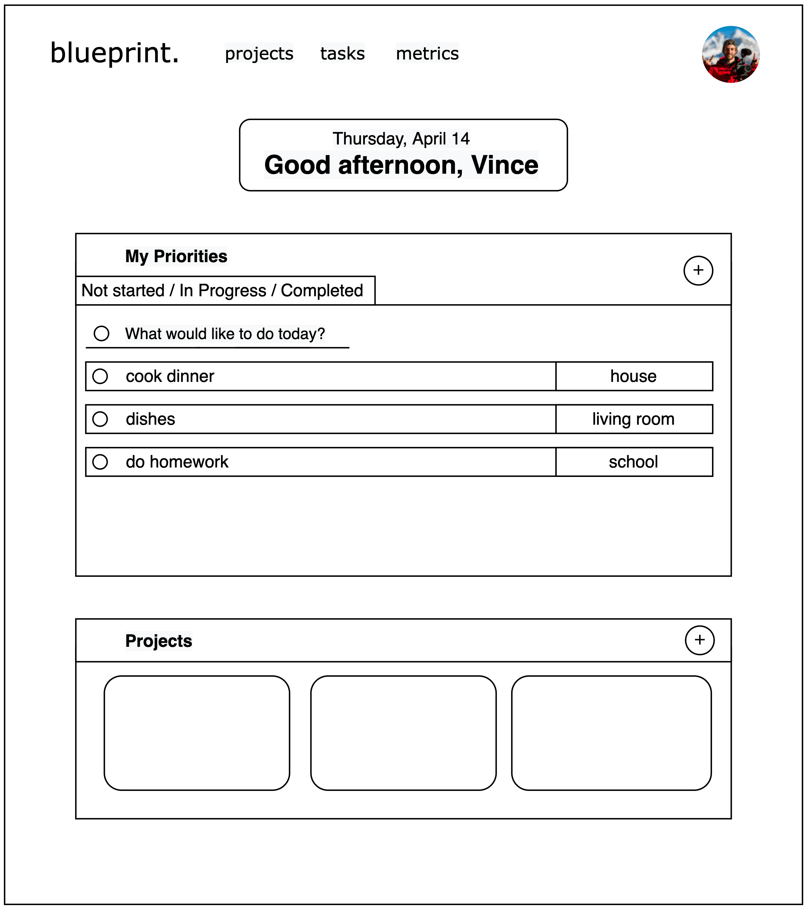
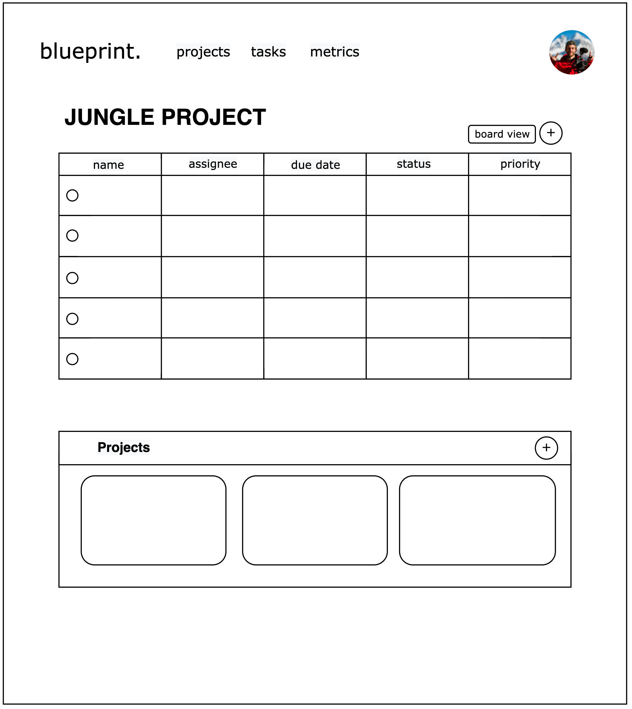
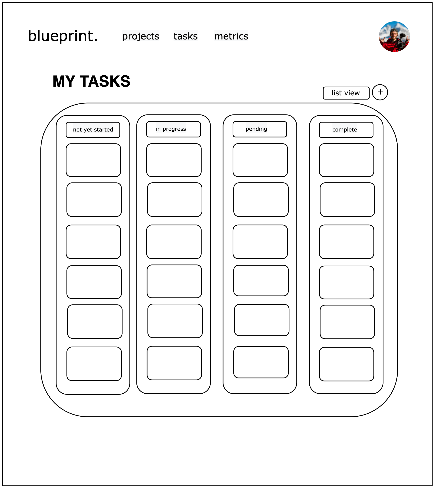
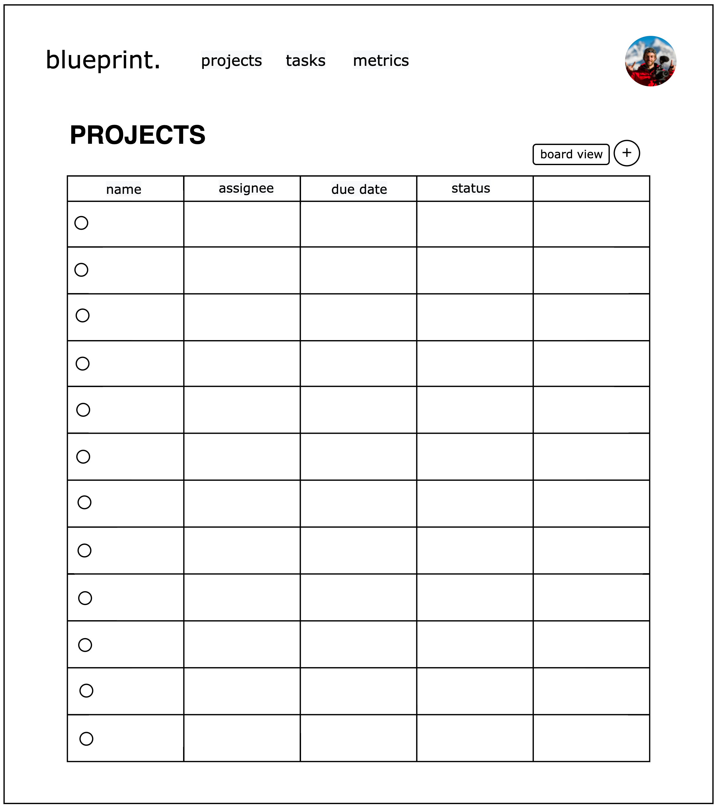
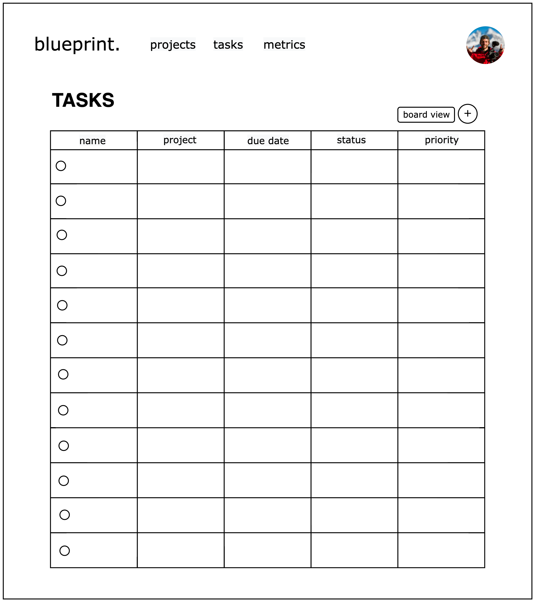
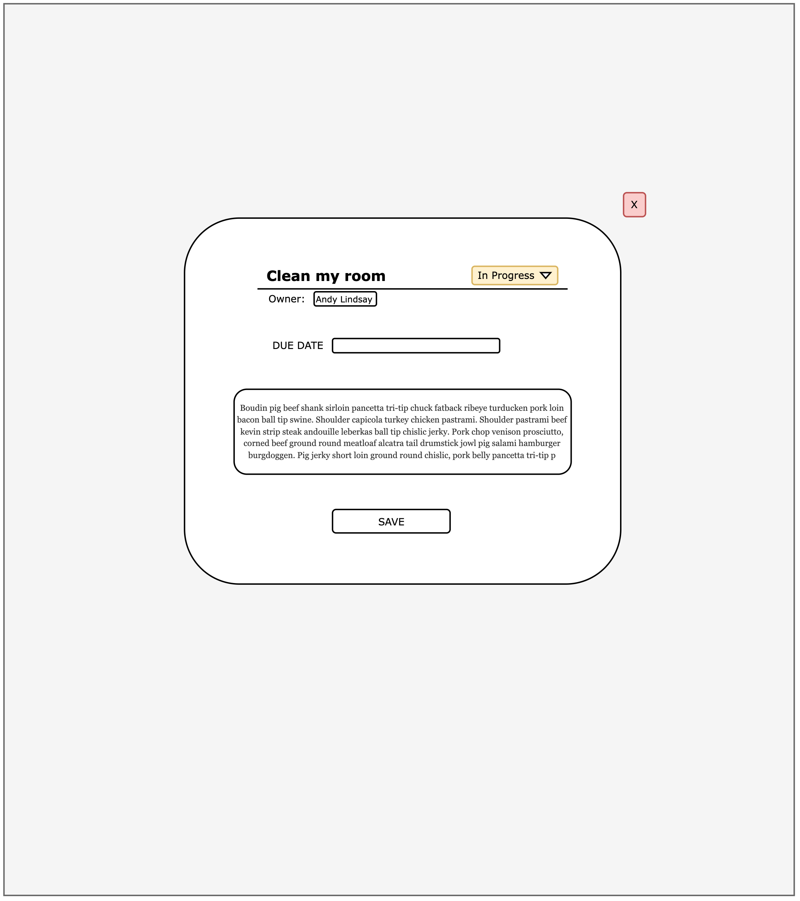
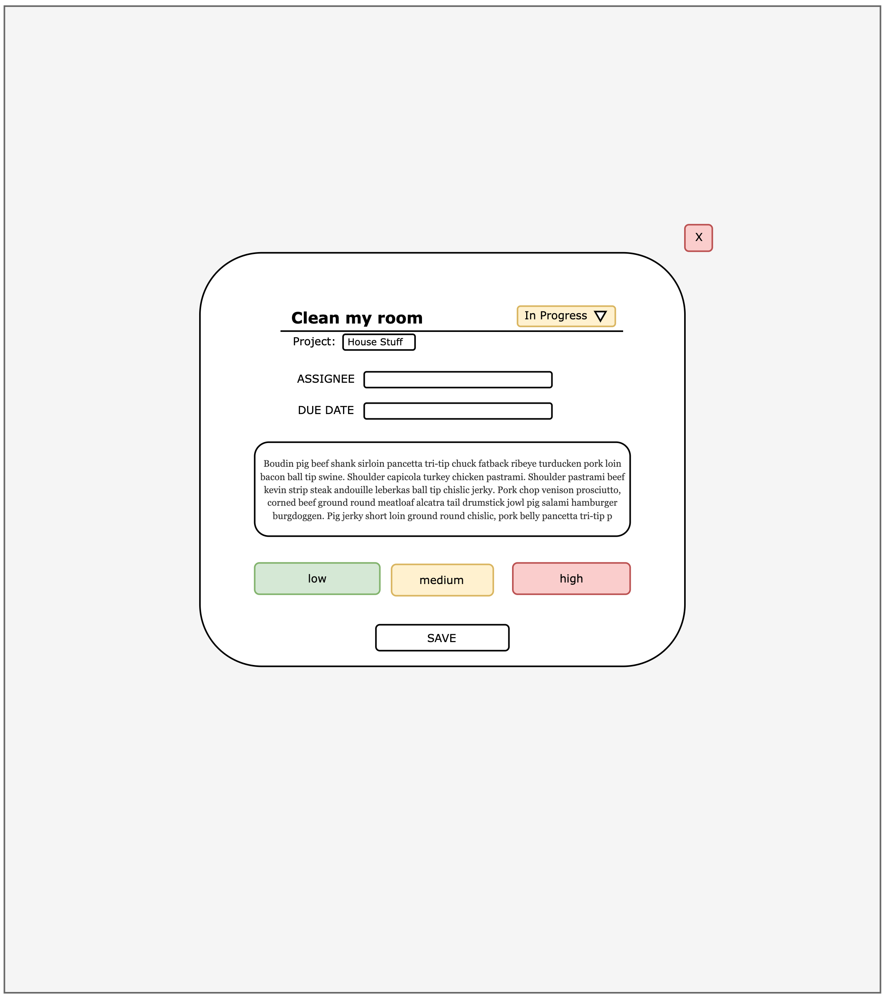

<h1>Wireframe for "blueprint"</h1>

   
   
  <h3>Home Page (Dashboard)</h3>
  
   
   

---

   
   
  <h3>Project View (List)</h3>
  
   
   

---

   
   
  <h3>Project View (Board)</h3>
  
   
   

---

   
   
  <h3>All Tasks View (Board)</h3>
  
   
   

---

   
   
  <h3>All Projects View</h3>
  
   
   

---

   
   
  <h3>All Tasks View (List)</h3>
  
   
   

---

   
   
  <h3>Project - New/Edit/View</h3>
  
   
   

---

   
   
  <h3>Task - New/Edit/View</h3>
  
   
   

---

